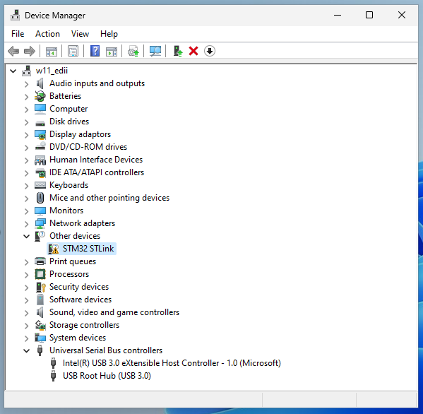
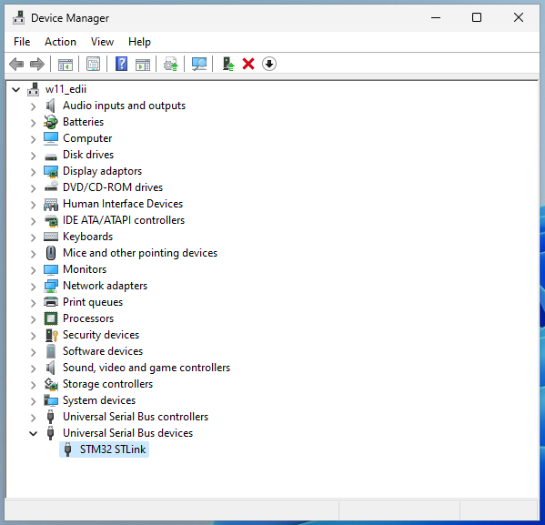

# Guia de instalacion de herramientas
En las siguientes secciones se encontraran instrucciones para instalar las herramientas necesarias para compilar un programa para el microcontrolador y para flashear el mismo.
La guia se divide en dos, dependiendo si su sistema operativo es Linux (:heart:) o Windows (:poop:).

## Descripcion de las Herramientas

### ARM Toolchain
Cuando nosotros compilamos un programa con `gcc`, lo estamos compilando para correr en una arquitectura como la de nuestro PC (x86_x64).
En particular, la version 11.4.0 de `gcc` para Ubuntu soporta las siguientes arquitecturas: 
```bash
 marifante@marifante-AORUS-15P-KD  ~/UNSAM/EDII/repos/stm32f103xx_drivers_impl/stm32f103xx_drivers  gcc -E -march=help -xc /dev/null
# 0 "/dev/null"
cc1: error: bad value (‘help’) for ‘-march=’ switch
cc1: note: valid arguments to ‘-march=’ switch are: nocona core2 nehalem corei7 westmere sandybridge corei7-avx ivybridge core-avx-i haswell core-avx2 broadwell skylake skylake-avx512 cannonlake icelake-client rocketlake icelake-server cascadelake tigerlake cooperlake sapphirerapids alderlake bonnell atom silvermont slm goldmont goldmont-plus tremont knl knm x86-64 x86-64-v2 x86-64-v3 x86-64-v4 eden-x2 nano nano-1000 nano-2000 nano-3000 nano-x2 eden-x4 nano-x4 k8 k8-sse3 opteron opteron-sse3 athlon64 athlon64-sse3 athlon-fx amdfam10 barcelona bdver1 bdver2 bdver3 bdver4 znver1 znver2 znver3 btver1 btver2 native
```

Como veran, no aparece ninguna arquitectura relacionada con ARM! Por lo tanto, tenemos que bajarnos un compilador que sirva para eso. 

Aca es donde necesitamos usar el toolchain de ARM, el cual posee una serie de herramientas para trabajar con un microcontrolador ARM.
Entre estas herramientas se incluyen:

* `arm-none-eabi-gcc`: Un cross-compilador que compila codigo C a un binario que pueda ser interpretado por el microcontrolador ARM.
En particular, primero preprocesa el codigo C evaluando todas las directivas de pre-procesador y removiendo comentarios, generando un archivo temporal `.i`.
Luego, estos archivos `.i` son transformados a codigo assembly `.s`. Despues, este codigo assembly (`.s`) genera archivos objeto `.o`, los cuales ya son binarios.
En definitiva, esta herramienta: preprocesa -> compila -> ensambla.

* `arm-none-eabi-ld`: Un linker que reune varios archivos objeto (.o) y librerias estaticas (.a) para generar un archivo binario unico que pueda ser grabado en el microcontrolador.
El compilador `arm-none-eabi-gcc` va a generar un archivo `.o` por cada `.c` que haya que compilar! Por lo tanto, en este paso lo que hacemos es "juntar" todos estos `.o`.
El archivo de salida que termina produciendo el linker es un `.elf`, el cual es un estandar.

* `arm-none-eabi-objcopy`: Una utilidad que nos permite copiar el contenido de un archivo objeto a otro archivo, cambiando el formato del archivo destino.
El linker produce un archivo `.elf` que tiene mucha informacion ademas de las instrucciones (posee la tabla de simbolos, informacion de debug, etc).
El microcontrolador no necesita esto para poder operar, solo necesita las instrucciones crudas.
Por lo tanto, con la heramienta `arm-none-eabi-gcc`, "borramos" toda la informacion extra para dejar solo un binario que posea las instrucciones que debe ejecutar el microcontrolador.

## Instalacion en Linux :heart:

### ARM Toolchain y OpenOCD

La catedra creo un script de conveniencia para poder instalar el toolchain de ARM y OpenOCD de manera rapida y sencilla.
Desde la raiz de este repositorio ejecutar lo siguiente:
```bash
./scripts/install_tools.sh
```
Luego de ejecutar el script, salir y entrar de la terminal y verificar si:
* el toolchain es encontrado ejecutando `arm-none-eabi-gcc` en la terminal.
* OpenOCD es encontrado ejecutando `openocd` en la terminal.

### ST-LINK

Para instalar el software necesario para utilizar el programador (ST-LINK), se utilizara el administrador de paquetes de la distribucion utilizada. Desde la raiz de este repositorio ejecutar lo siguiente:
```bash
sudo apt install ./tools/stlink_1.7.0-1_amd64.deb
```

## Instalacion en Windows :poop:

### ARM Toolchain, OpenOCD y herramientas de GNU
Para poder instalar las herramientas en Windows, utilizaremos el manejador de paquetes [Chocolatey](https://chocolatey.org/install). Chocolatey funciona como el `apt-get` de Ubuntu, podremos descargar paquetes por consola.

Para instalarlo, seguir la guia de instalacion (Install Chocolatey for Individual Use) en la web de Cocolatey: https://chocolatey.org/install#individual.

La catedra tambien creo un script de conveniencia para instalar casi todas las herramientas usando Chocolatey. Para instalarlas, realizar lo siguiente:

1) Abrir una terminal **como administrador**.
2) Dentro del a terminal, ubicarse sobre la raiz de este repositorio utilizando el commando `cd`.
3) Ejecutar el script de instalacion:
```
.\scripts\install_tools.bat
```

### W-ST-LINK

Para utilizar el programador del microcontrolador STM32 deben ser descargados los drivers para el mismo. Estos se encuentran en la pagina oficial de STMicroelectronics: https://www.st.com/en/development-tools/stsw-link004.html#get-software


### Guia de resolucion de problemas

#### LIBUSB_ERROR_NOT_SUPPORTED

En el caso de que al ejecutar `make ocd-flash` se vea el siguiente error:

<p align="center">
    
</p>

El error se debe a que no se instalaron los drivers del programador! Se puede confirmar esto yendo al administrador de dispositivos y viendo que aparece un signo de advertencia en el dispositivo `STM32 STLink`:

<p align="center">
    
</p>

Para solucionarlo, simplemente instalar el driver como se indica en la seccion de instalacion del ST-LINK en Windows.

Al terminar de instalarlo, abrir de vuelta el administrador de dispositivos y deberia visualizarse el dispositivo sin un signo de advertencia.

<p align="center">
    
</p>