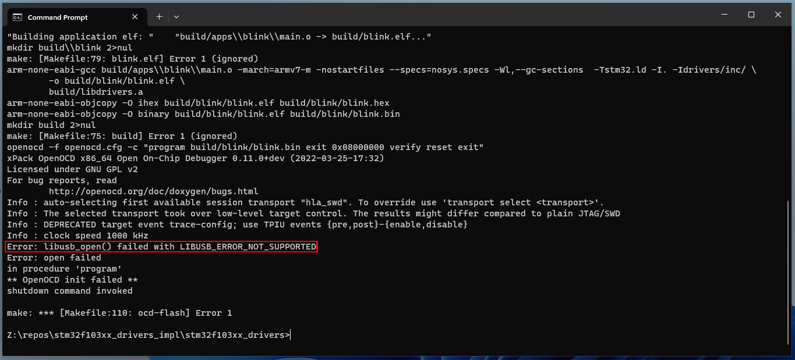

# Guia de instalacion de herramientas
En las siguientes secciones se encontraran instrucciones para instalar las herramientas necesarias para compilar un programa para el microcontrolador y para flashear el mismo.
La guia se divide en dos, dependiendo si su sistema operativo es Linux (:heart:) o Windows (:poop:).

## Descripcion de las Herramientas

### Toolchain de ARM
Cuando nosotros compilamos un programa con `gcc`, lo estamos compilando para correr en una arquitectura como la de nuestro PC (x86_x64).
En particular, la version 11.4.0 de `gcc` para Ubuntu soporta las siguientes arquitecturas: 
```bash
 marifante@marifante-AORUS-15P-KD  ~/UNSAM/EDII/repos/stm32f103xx_drivers_impl/stm32f103xx_drivers  gcc -E -march=help -xc /dev/null
# 0 "/dev/null"
cc1: error: bad value (‘help’) for ‘-march=’ switch
cc1: note: valid arguments to ‘-march=’ switch are: nocona core2 nehalem corei7 westmere sandybridge corei7-avx ivybridge core-avx-i haswell core-avx2 broadwell skylake skylake-avx512 cannonlake icelake-client rocketlake icelake-server cascadelake tigerlake cooperlake sapphirerapids alderlake bonnell atom silvermont slm goldmont goldmont-plus tremont knl knm x86-64 x86-64-v2 x86-64-v3 x86-64-v4 eden-x2 nano nano-1000 nano-2000 nano-3000 nano-x2 eden-x4 nano-x4 k8 k8-sse3 opteron opteron-sse3 athlon64 athlon64-sse3 athlon-fx amdfam10 barcelona bdver1 bdver2 bdver3 bdver4 znver1 znver2 znver3 btver1 btver2 native
```

Como veran, no aparece ninguna arquitectura relacionada con ARM! Por lo tanto, tenemos que bajarnos un compilador que sirva para eso. 

Aca es donde necesitamos usar el toolchain de ARM, el cual posee una serie de herramientas para trabajar con un microcontrolador ARM.
Entre estas herramientas se incluyen:

* `arm-none-eabi-gcc`: Un cross-compilador que compila codigo C a un binario que pueda ser interpretado por el microcontrolador ARM.
En particular, primero preprocesa el codigo C evaluando todas las directivas de pre-procesador y removiendo comentarios, generando un archivo temporal `.i`.
Luego, estos archivos `.i` son transformados a codigo assembly `.s`. Despues, este codigo assembly (`.s`) genera archivos objeto `.o`, los cuales ya son binarios.
En definitiva, esta herramienta: preprocesa -> compila -> ensambla.

* `arm-none-eabi-ld`: Un linker que reune varios archivos objeto (.o) y librerias estaticas (.a) para generar un archivo binario unico que pueda ser grabado en el microcontrolador.
El compilador `arm-none-eabi-gcc` va a generar un archivo `.o` por cada `.c` que haya que compilar! Por lo tanto, en este paso lo que hacemos es "juntar" todos estos `.o`.
El archivo de salida que termina produciendo el linker es un `.elf`, el cual es un estandar.

* `arm-none-eabi-objcopy`: Una utilidad que nos permite copiar el contenido de un archivo objeto a otro archivo, cambiando el formato del archivo destino.
El linker produce un archivo `.elf` que tiene mucha informacion ademas de las instrucciones (posee la tabla de simbolos, informacion de debug, etc).
El microcontrolador no necesita esto para poder operar, solo necesita las instrucciones crudas.
Por lo tanto, con la heramienta `arm-none-eabi-gcc`, "borramos" toda la informacion extra para dejar solo un binario que posea las instrucciones que debe ejecutar el microcontrolador.

## Instalacion en Windows :poop:

1. **Instalacion de Chocolatey**: para poder instalar las herramientas en Windows, utilizaremos el manejador de paquetes [Chocolatey](https://chocolatey.org/install). Chocolatey funciona como el `apt-get` de Ubuntu, con el podremos descargar paquetes por consola. Para instalarlo, seguir la guia de instalacion (Install Chocolatey for Individual Use) en la web de Cocolatey: https://chocolatey.org/install#individual.

2. **Instalacion de Git**: Abrir un `command prompt` (terminal) **como administrador** y ejecutar el siguiente comando para instalar git.

```bash
choco install git --yes
```

Al ejecutar esto, se deberá ver algo como lo siguiente en pantalla:

<p align="center">
    
</p>

Nota: la descarga e instalación del paquete puede tardar aproximadamente entre 3 y 5 minutos, dependiendo de la velocidad de bajada que posea la PC.

3. **Clonar el repositorio**: En el `command prompt` de administrador clonar este repositorio.
Primero, recuerden cambiar de directorio a donde quieren que el repo sea clonado.
Es decir, cambien el string **REPOSITORY_PATH** del siguiente comando por la direccion que quieran, por ejemplo: `C:\Users\JnRod\Documents\EDII` (recuerden no utilizar nombres de directorios con espacios).

```bash
cd REPOSITORY_PATH
git clone https://github.com/UNSAM-ECYT-ED/stm32f103xx_drivers.git
```

Al ejecutar esto, se deberá ver algo como lo siguiente en pantalla:
<p align="center">
    
</p>

4. **Instalacion del toolchain de ARM, OpenOCD y herramientas de GNU**: En el `command prompt` de administrador dirigirse al directorio del repositorio y ejecutar el script `install_tools.bat`.

```bash
cd stm32f103xx_drivers
.\scripts\install_tools.bat
```

Durante la ejecución del script, se debería ver algo como lo siguiente en pantalla:
<p align="center">
    
</p>

Nota 1: la ejecución del script puede tardar entre 15 y 20 min, dependiendo de la velocidad de bajada que posea la PC.

Nota 2: Si la instalacion se cuelga en algun porcentaje, clickear la terminal y presionar a tecla "ENTER". A veces windows se cuelga, es una de las razonas por las cuales lo detestamos.

5. **ST-LINK**: Para utilizar el programador del microcontrolador STM32 deben ser descargados los drivers para el mismo. Estos se encuentran en la pagina oficial de STMicroelectronics: https://www.st.com/en/development-tools/stsw-link004.html#get-software

6. **Python**: Para comunicarse con el STM32 a traves del puerto serie, se debe instalar un paquete de python llamado "pyserial". Primero se debe instalar python descargando el instalador desde aqui: https://www.python.org/downloads/windows/.
Tildar en la instalacion la opcion correspondiente para agregar python al PATH.

7. **Py-serial**: Este es el paquete que necesitamos para comunicarnos a traves del puerto serie con el microcontrolador.
Para instalarlo, ejecutar lo siguiente en una terminal:

```
 python -m ensurepip --upgrade
```

## Instalacion en Linux :heart:

La guia supone que se esta utilizando Ubuntu, en el caso de que se este utilizando otra distribucion, cambiar los respectivos llamados al manejador de paquetes `apt` con el correspondiente a su distribucion.

1. **Instalacion de git**: para poder clonarse el repositorio, instalar git. Para ello, abrir una terminal y ejecutar el siguiente comando.

```bash
sudo apt update -y && sudo apt install -y git
```

2. **Clonar el repositorio**: En la terminal clonar el repositorio utilizando:

```bash
git clone https://github.com/UNSAM-ECYT-ED/stm32f103xx_drivers.git
```

3. **Instalacion del toolchain de ARM y OpenOCD**: En la terminal dirigirse al directorio del repositorio y ejecutar el script `install_tools.sh`.

```bash
cd stm32f103xx_drivers
./scripts/install_tools.sh
```

4. **ST-LINK**: Para instalar el software necesario para utilizar el programador (ST-LINK), se utilizara el administrador de paquetes de la distribucion utilizada. Desde la raiz de este repositorio ejecutar lo siguiente:
```bash
sudo apt install ./tools/stlink_1.7.0-1_amd64.deb
```

## Verificar si la instalacion fue correcta

Luego de haber seguido los pasos de instalacion, realizar lo siguiente para verificar que todo se haya instalado correctamente.

1. **Verificacion del toolchain de ARM**: Abrir una terminal y verificar si el toolchain de ARM es encontrado en el PATH ejecutando el comando `arm-none-eabi-gcc`.
Si es contrado correctamente, algo similar a lo siguiente se deberia ver en la terminal:

<p align="center">
    
</p>

Nota: El mensaje `fatal error: no input files` es esperable, dado que no le estamos indicando ningun codigo fuente al compilador.

2. **Verificacion de OpenOCD**: En la terminal, verificar si OpenOCD es encontrado en el PATH ejecutando el comando `openocd`.
Si es contrado correctamente, algo similar a lo siguiente se deberia ver en la terminal:

<p align="center">
    
</p>

3. **Verificacion del driver ST-LINK**: Conectar el programador ST-LINK a la PC y a la placa BluePill (revisar el conexionado de la interfaz SWD y la alimentacion). Luego, en la terminal, ir al directorio raiz de este repositorio y ejecutar el comando `make ocd-flash TARGET=blink`.
Este comando deberia compilar y flashear en el el procesador de la placa BluePill una aplicacion que parpadea su led.

<p align="center">
    
</p>

### Guia de resolucion de problemas

#### LIBUSB_ERROR_NOT_SUPPORTED

En el caso de que al ejecutar `make ocd-flash` se vea el siguiente error:

<p align="center">
    
</p>

El error se debe a que no se instalaron los drivers del programador! Se puede confirmar esto yendo al administrador de dispositivos y viendo que aparece un signo de advertencia en el dispositivo `STM32 STLink`:

<p align="center">
    
</p>

Para solucionarlo, simplemente instalar el driver como se indica en la seccion de instalacion del ST-LINK en Windows.

Al terminar de instalarlo, abrir de vuelta el administrador de dispositivos y deberia visualizarse el dispositivo sin un signo de advertencia.

<p align="center">
    
</p>