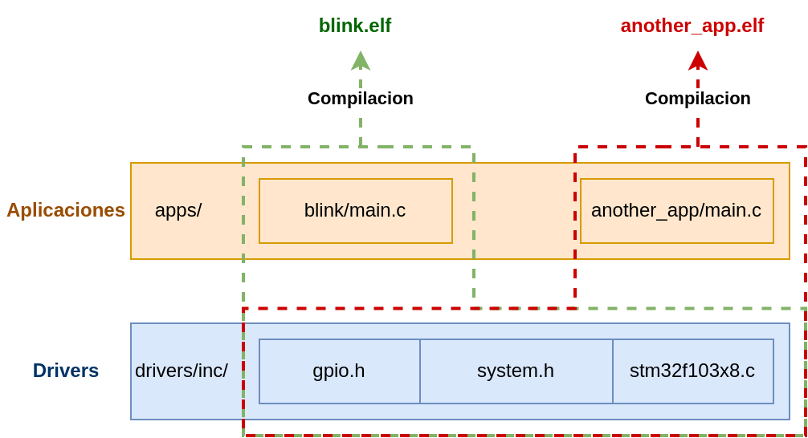

# STM32F103xx Drivers
En este repositorio se encontraran una serie de prototipos de funciones las de drivers para el microcontrolador STM32F103C8.
Este microcontrolador es el que posee la placa BluePill.
Los prototipos tienen descripciones los cuales brindan una idea de como deben ser implementados.

# Estructura del codigo fuente

El codigo fuente se encuentra dividido en dos partes: aplicaciones (`apps`) y drivers (`drivers`).

El objetivo de esta separacion es abstraer a la logica de negocios de las aplicaciones de la interaccion con el microcontrolador a bajo nivel. Por ejemplo, en la aplicacion `blink` solo se encuentra un main que llama periodicamente a funciones del estilo `gpio_toggle()`, las cuales estan implementadas en el módulo `gpio` de la libreria drivers.

<p align="center">
    
</p>

## Aplicaciones
Las `apps` poseen la logica particular del programa.
Cada aplicacion tiene su propio `main` y hace uso de funciones encontradas en los `drivers`. Por ejemplo, la aplicacion `blink` tiene un programa en el cual el microcontrolador `togglea` el valor de un GPIO periodicamente.

Cada aplicacion tiene su sub-directorio en el directorio `apps`. Por ejemplo, el codigo fuente de la aplicacion `blink` se encuentra en `apps/blink/main.c`. Si fueramos a agregar otra aplicacion llamada `i2c_comm`, su respectivo codigo fuente se deberia encontrar en `apps/i2c_comm/main.c`.

## Drivers
Los `drivers` son un conjunto de modulos que componen una libreria. La idea es que esta libreria posea codigo que sirva para interactuar con los registros del microcontrolador.
Cada modulo de esta libreria posee un archivo publico (`.h`) y otro privado (`.c`).
Los archivos publicos son los incluidos por las aplicaciones y poseen los prototipos de las funciones. 
Por otro lado, los archivos privados poseen las implementaciones de las funciones.


# Guia de instalacion de herramientas
Para instalar las herramientas necesarias para compilar y depurar codigo en su PC, por favor siga las instrucciones encontradas en [INSTALL.md](INSTALL.md).

# Compilacion

Para compilar una aplicacion, ejecutar lo siguiente en una terminal:
```bash
make build
```

# Grabar aplicacion en microcontrolador con OpenOCD

Para grabar una aplicacion (un binario) en el microcontrolador, ejecutar lo siguiente en una terminal:
```bash
make ocd-flash
```

# Debugging con OpenOCD y GDB

* En una terminal, dejar corriendo open-ocd:
```bash
make ocd-start
```

* En otra terminal, ejecutar gdb para depurar la ejecucion del programa:
```bash
make debug
```

# Links

* [STM32F103C8 microcontroller datasheet](https://www.st.com/en/microcontrollers-microprocessors/stm32f103c8.html)

* [STM32F103C8 reference manual](https://www.st.com/resource/en/reference_manual/rm0008-stm32f101xx-stm32f102xx-stm32f103xx-stm32f105xx-and-stm32f107xx-advanced-armbased-32bit-mcus-stmicroelectronics.pdf)

* [STM32F1xx Cortex-M3 programming manual](https://www.st.com/content/ccc/resource/technical/document/programming_manual/5b/ca/8d/83/56/7f/40/08/CD00228163.pdf/files/CD00228163.pdf/jcr:content/translations/en.CD00228163.pdf)

* [Bluepill development kit](https://stm32-base.org/boards/STM32F103C8T6-Blue-Pill.html)
