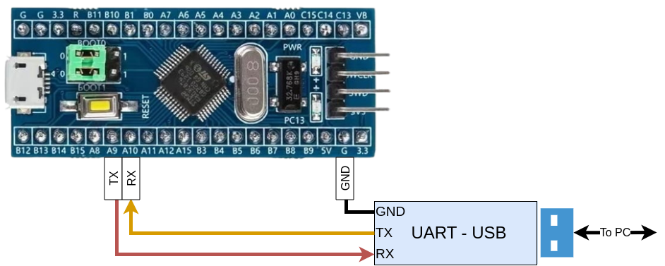

# UART

Una UART (Universal Asynchronous Receiver/Transmitter) es un protocolo de comunicación de hardware entre dos dispositivos.

## Conexionado

En el STM32F1xxx la USART1 se encuentra mapeada en los siguientes pines:

| USART                       | Function   | STM32F1xx pin |
|-----------------------------|------------|---------------|
| USART1                      | RX         | PA10          |
|                             | TX         | PA9           |

La conexion entre el microcontrolador y el conversor USB-UART debe ser cruzada.
Es decir, el RX del STM32 (PA10) debe conectarse al TX del conversor USB-UART.
Analogamente, el TX del STM32 (PA9) debe conectarse al RX del conversor USB-UART.
Además, se debe conectar un cable entre los GNDs del kit de desarrollo (BluePill) y del conversor USB-UART.

    

